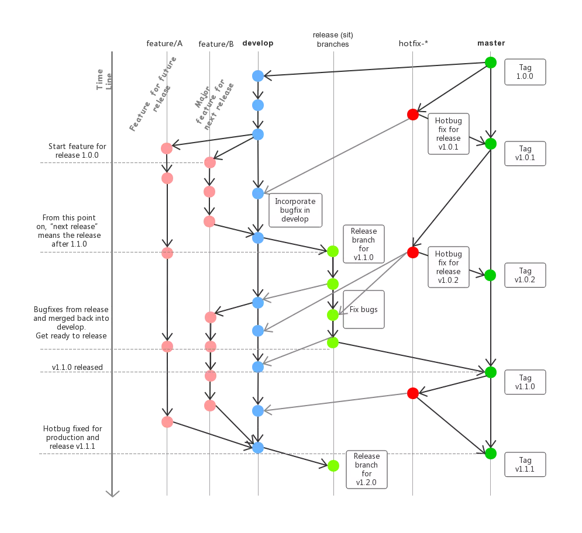
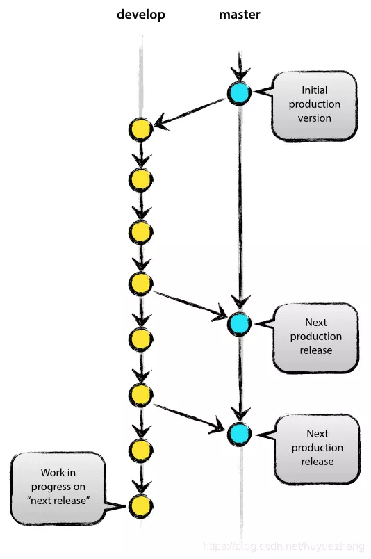
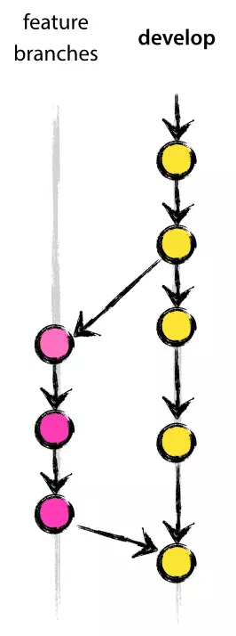
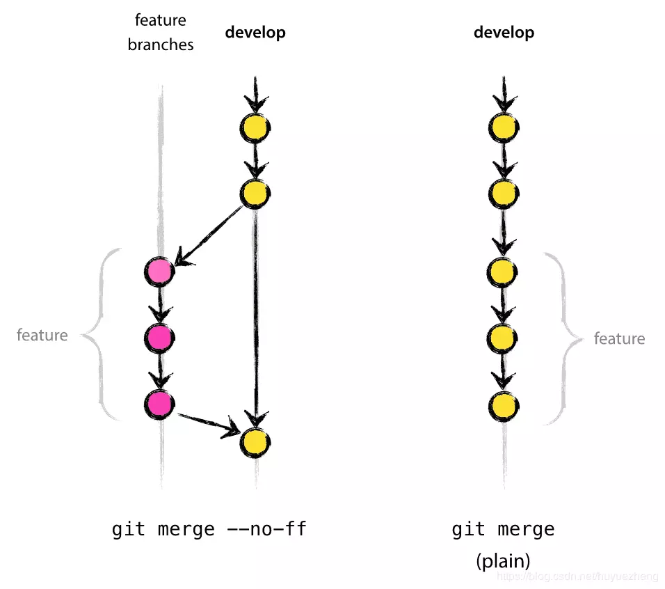
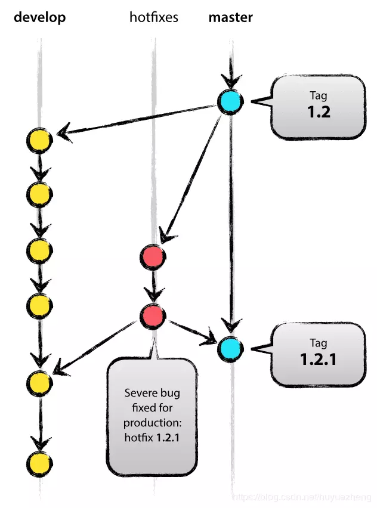
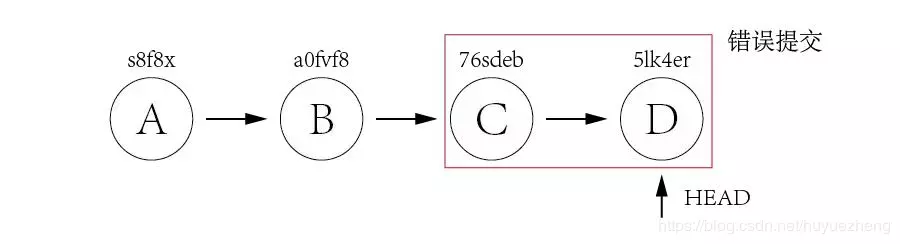
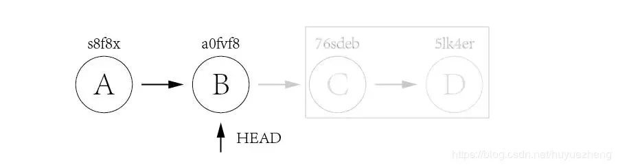
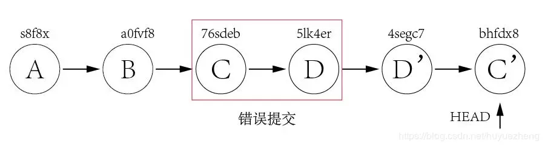
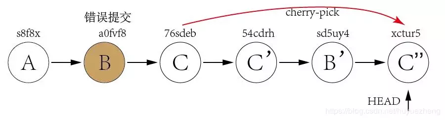

# 看完，我不信你不会GIT！！！

#### 一、常用命令介绍

* * *

##### 1.1 命令行介绍

###### 1.1.1 Git 全局设置

```csharp
$ git config --global user.name "knight"
$ git config --global user.email "knight@dayuan.com"
```

###### 1.1.2 创建一个新仓库（本地）

```bash
$ git clone http://git.dayuan.cc/practice/git-exmple.git
cd git-exmple
$ touch README.md
$ git add README.md
$ git commit -m "add README"
$ git push -u origin master
```

###### 1.1.3 在已存在的目录中创建仓库

```csharp
cd existing_folder
$ git init
$ git remote add origin http://git.dayuan.cc/practice/git-exmple.git
$ git add .
$ git commit -m "Initial commit"
$ git push -u origin master
```

###### 1.1.4 将本地已存在的仓库推送到远程仓库

```csharp
cd existing_repo
$ git remote rename origin old-origin
$ git remote add origin http://git.dayuan.cc/practice/git-exmple.git
$ git push -u origin --all
$ git push -u origin --tags
```

###### 1.1.5 查看分支相关命令

```ruby
$ git branch -r; //查看远程分支
$ git branch; //查看本地分支
$ git branch -a; //查看所有分支
```

###### 1.1.6 拉取远程分支并创建本地分支

```cpp
// dev2为远程分支,dev1为本地分支
$ git checkout -b dev1 origin/dev2; 
```

*   `从远程分支dev拉取到本地并且创建本地分支dev，且俩者之间建立映射关系,同时当前分支会切换到dev1`

```cpp
//dev2为远程分支,dev1为本地分支
$ git fetch origin dev2:dev1;
```

*   `使用该方式会在本地新建分支dev1，但是不会自动切换到该本地分支dev1，需要手动checkout。采用此种方法建立的本地分支不会和远程分支建立映射关系。`

###### 1.1.7 建立本地分支与远程分支的映射关系（或者为跟踪关系track）

*   这样使用git pull或者git push时就不必每次都要指定从远程的哪个分支拉取合并和推送到远程的哪个分支了。

```ruby
$ git branch -vv
```

*   `输出映射关系`

```cpp
// dev为远程分支名
$ git branch -u origin/dev
```

*   `将当前本地分支与远程分支建立映射关系`

```bash
$ git branch --unset-upstream 
```

*   `撤销当前本地分支与远程分支的映射关系`

###### 1.1.8 切换当前本地分支

```cpp
// dev为本地分支名
$ git checkout dev;
```

###### 1.1.9 拉取远程分支代码

```ruby
$ git pull
```

*   `使用的前提是当前分支需要与远程分支之间建立映射关系`

###### 1.1.10 推送本地分支代码到远程分支

```ruby
$ git push
```

*   `使用的前提是当前分支需要与远程分支之间建立映射关系`

###### 1.1.11 合并分支

*   场景:现在有dev本地分支与远程分支，master本地分支与远程分支  
    现在将dev的分支代码合并到master主干上
*   思路步骤 :  
    1.`切换到本地分支dev上，并且pull拉取一下远程dev分支上的改动地方`  
    2.`将所有本地修改进行commit并且push到远程dev分支上，保证没有遗漏的，确保当前本地dev与远程dev是一致的`  
    3.`将当前本地分支切换到本地master上`  
    4.`将本地分支dev合并到本地master上`  
    5.`将本地已经合并了dev分支的master进行push到远程master上 大概思路就是这样。需要注意的是在进行merge(合并)的时候需要禁用fast-forward模式`
*   具体的合并命令: `git merge --no-ff dev (dev为本地被合并的分支名字)`

#### 二、Gitflow总览

* * *



git_flow流程图.png

从上图可以看到主要包含下面几个分支：  
`master` : 主分支，主要用来版本发布。  
`develop`：日常开发分支，该分支正常保存了开发的最新代码。  
`feature`：具体的功能开发分支，只与 develop 分支交互。  
`release`：`release`分支可以认为是`master` 分支的未测试版。比如说某一期的功能全部开发完成，那么就将 `develop` 分支合并到 `release` 分支，测试没有问题并且到了发布日期就合并到`master` 分支，进行发布。  
`hotfix`：线上 bug 修复分支。  
除此之后还可以有 `fast-track` 等分支。

##### 2.1 主分支

主分支包括 `master` 分支和 `develop` 分支。`master` 分支用来发布，`HEAD` 就是当前线上的运行代码。`develop`分支就是我们的日常开发。使用这两个分支就具有了最简单的开发模式：`develop`分支用来开发功能，开发完成并且测试没有问题则将 `develop`分支的代码合并到 `master`分支并发布。  



master-develop.png

这引入了几个问题：

`develop`分支只有发布完了才能进行下一个版本开发，开发会比较缓慢。  
线上代码出现 bug 如何进行 bug 修复。  
带着这两个问题往下看。

##### 2.2 辅助分支

主要介绍的辅助分支如下：  
`feature`分支  
`release`分支  
`hotfix`分支  
通过这些分支，我们可以做到：团队成员之间并行开发，`feature track`更加容易，开发和发布并行以及线上问题修复。

###### 2.2.1 Feature 分支

**`feature`分支用来开发具体的功能，一般 fork 自 `develop`分支，最终可能会合并到`develop`分支。**比如我们要在下一个版本增加`功能1`、`功能2`、`功能3`。那么我们就可以起三个`feature`分支：`feature1`，`feature2`，`feature3`。（`feature`分支命名最好能够自解释，这并不是一种好的命名。）随着我们开发，`功能1`和`功能2`都被完成了，而`功能3`因为某些原因完成不了，那么最终 `feature1` 和 `feature2`分支将被合并到 `develop`分支，而 `feature3`分支将被干掉。  



develop-feature.png

我们来看几个相关的命令。

###### 2.2.1.1 新建feature分支

从 `develop` 分支建一个 `feature` 分支，并切换到 `feature` 分支

```cpp
$ git checkout -b myfeature develop
Switched to a new branch "myfeature"
```

###### 2.2.1.2 合并feature 分支到 develop

```ruby
$ git checkout develop
Switched to branch 'develop'
$ git merge --no-ff myfeature
Updating ea1b82a..05e9557
(Summary of changes)
$ git branch -d myfeature
Deleted branch myfeature
$ git push origin develop
```

上面我们 merge 分支的时候使用了参数 `--no-ff`，**ff** 是`fast-forward`的意思，`--no-ff`就是禁用`fast-forward`。关于这两种模式的区别如下图。（可以使用 sourceTree 或者命令git log --graph查看。）  



fast-forward模式的效果.png

看了上面的图，那么使用`非fast-forward`模式来 merge 的好处就不言而喻了：我们知道哪些`commit` 是某些`feature` 相关的。虽然 `git merge`的时候会自动判断是否使用`fast-farward`模式，但是有时候为了更明确，我们还是要加参数`--no-ff`或者`--ff`。

###### 2.2.2 Release 分支

`release`分支在我看来是 `pre-master`。`release`分支从 `develop` 分支 `fork` 出来，最终会合并到 `develop`分支和 `master`分支。合并到 `master`分支上就是可以发布的代码了。有人可能会问那为什么合并回 `develop`分支呢？很简单，有了 `release`分支，那么相关的代码修复就只会在 `release`分支上改动了，最后必然要合并到 `develop`分支。下面细说。

我们最初所有的开发工作都在 `develop`分支上，当我们这一期的功能开发完毕的时候，我们基于 `develop`分支开一个新的`release`分支。这个时候我们就可以对 `release`分支做统一的测试了，另外做一些发布准备工作：比如版本号之类的。

如果测试工作或者发布准备工作和具体的开发工作由不同人来做，比如国内的 RD 和 QA，这个 RD 就可以继续基于`develop`分支继续开发了。再或者说公司对于发布有严格的时间控制，开发工作提前并且完美的完成了，这个时候我们就可以在`develop` 分支上继续我们下一期的开发了。同时如果测试有问题的话，我们将直接在`release`分支上修改，然后将修改合并到`develop`分支上。

待所有的测试和准备工作做完之后，我们就可以将 `release`分支合并到`master` 分支上，并进行发布了。

一些相关命令如下。

###### 新建 release 分支

```ruby
$ git checkout -b release-1.2 develop
Switched to a new branch "release-1.2"
$ ./bump-version.sh 1.2
File modified successfully, version bumped to 1.2.
$ git commit -a -m "Bumped version number to 1.2"
[release-1.2 74d9424] Bumped version number to 1.2
1 files changed, 1 insertions(+), 1 deletions(-)
```

###### 2.2.2.1 release 分支合并到 master 分支

```ruby
$ git checkout master
Switched to branch 'master'
$ git merge --no-ff release-1.2
Merge made by recursive.
(Summary of changes)
$ git tag -a 1.2
```

###### 2.2.2.2 release 分支合并到 develop 分支

```ruby
$ git checkout develop
Switched to branch 'develop'
$ git merge --no-ff release-1.2
Merge made by recursive.
(Summary of changes)
```

###### 2.2.2.3 最后，删除 release 分支

```ruby
$ git branch -d release-1.2
Deleted branch release-1.2 (was ff452fe).
```

###### 2.2.3 Hotfix 分支

顾名思义，`hotfix`分支用来修复线上 bug。当线上代码出现 bug 时，我们基于 `master`分支开一个 `hotfix`分支，修复 bug 之后再将 `hotfix`分支合并到`master`分支并进行发布，同时 `develop`分支作为最新最全的代码分支，`hotfix`分支也需要合并到 `develop`分支上去。仔细想一想，其实 `hotfix`分支和 `release`分支功能类似。`hotfix`的好处是不打断`develop` 分支正常进行，同时对于生产代码的修复貌似也没有更好的方法了（总不能直接修改 `master`代码吧）。  



hotfixes.png

一些相关的命令。

###### 2.2.3.1 新建 hotfix 分支

```ruby
$ git checkout -b hotfix-1.2.1 master
Switched to a new branch "hotfix-1.2.1"
$ ./bump-version.sh 1.2.1
Files modified successfully, version bumped to 1.2.1.
$ git commit -a -m "Bumped version number to 1.2.1"
[hotfix-1.2.1 41e61bb] Bumped version number to 1.2.1
1 files changed, 1 insertions(+), 1 deletions(-)
```

###### 2.2.3.2 Fix bug

```csharp
$ git commit -m "Fixed severe production problem"
[hotfix-1.2.1 abbe5d6] Fixed severe production problem
5 files changed, 32 insertions(+), 17 deletions(-)
```

###### 2.2.3.3 buffix 之后，hotfix 合并到 master

```ruby
$ git checkout master
Switched to branch 'master'
$ git merge --no-ff hotfix-1.2.1
Merge made by recursive.
(Summary of changes)
$ git tag -a 1.2.1
```

###### 2.2.3.4 hotfix 合并到 develop 分支

```ruby
$ git checkout develop
Switched to branch 'develop'
$ git merge --no-ff hotfix-1.2.1
Merge made by recursive.
(Summary of changes)
```

###### 2.2.3.5 删除 hotfix 分支

```ruby
$ git branch -d hotfix-1.2.1
Deleted branch hotfix-1.2.1 (was abbe5d6).
```

#### 三、Git 分支管理和冲突解决

* * *

##### 3.1 合并分支间的修改 Merge

合并操作将两条或多条分支合并到一起，实际上有好几种分支合并方法，下面介绍主要的三种：

###### 3.1.1 直接合并(straight merge)：

把两条分支上的历史轨迹合并，交汇到一起。比如要把dev分支上的所有东东合并到master分支：

*   首先先到master分支：git checkout master
*   然后把dev给合并过来：git merge dev
*   注意没参数的情况下merge是fast-forward的，即Git将master分支的指针直接移到dev的最前方。
*   换句话说，如果顺着一个分支走下去可以到达另一个分支的话，那么Git在合并两者时，只会简单移动指针，所以这种合并成为`快进式(Fast-forward)`。

###### 3.1.2 压合合并(squashed commits)：

将一条分支上的若干个提交条目压合成一个提交条目，提交到另一条分支的末梢。

把dev分支上的所有提交压合成主分支上的一个提交，即压合提交：

```ruby
$ git checkout master
$ git merge --squash dev
```

此时，dev上的所有提交已经合并到当前工作区并暂存，但还没有作为一个提交，可以像其他提交一样，把这个改动提交到版本库中：

```csharp
$ git commit –m “something from dev”
```

###### 3.1.3 拣选合并(cherry-picking)：

拣选另一条分支上的某个提交条目的改动带到当前分支上。每一次提交都会产生一个全局唯一的提交名称，利用这个名称就可以进行拣选提交。  
比如在dev上的某个提交叫：321d76f  
把它合并到master中：

```ruby
$ git checkout master
$ git cherry-pick 321d76f
```

要拣选多个提交，可以给git cherry-pick命令传递-n选项，比如：

```ruby
$ git cherry-pick –n 321d76f
```

这样在拣选了这个改动之后，进行暂存而不立即提交，接着可以进行下一个拣选操作，一旦拣选完需要的各个提交，就可以一并提交。

##### 3.2 冲突处理

当两条分支对同一个文件的同一个文本块进行了不同的修改，并试图合并时，Git**不能自动合并**的，称之为`冲突(conflict)`。解决冲突需要人工处理。  
比如当前在`master`分支，想把`dev`分支`merge`过来，结果产生了一个冲突，打开文件内容可以看到这么一个冲突：

```bash
<<<<<<< HEAD

test in master

=======

test in dev

>>>>>>> dev
```

`<<<<<<<`标记冲突开始，后面跟的是当前分支中的内容。  
HEAD指向当前分支末梢的提交。  
`=======`之后，`>>>>>>>`之前是要merge过来的另一条分支上的代码。  
`>>>>>>>`之后的dev是该分支的名字。  
对于简单的合并，手工编辑，然后去掉这些标记，最后像往常的提交一样先add再commit即可。

##### 3.3 删除分支

有些分支没有必要长期保存，比如分支中的代码已经打了标签并已发布，或者实验分支已经成功完成工作或中途废弃等等。

**注意：打了标签的分支，Git在删除该分支时，从版本树起始到此标签间的全部历史轨迹均会保留，此时删除分支操作只是删除分支本身的名称，因此可以说该分支没有必要长期保存。**

而在其他版本控制工具中，删除分支通常意味着删除分支上的所有历史轨迹，所以不能因为打了标签就认为其没有必要保存。

删除一个分支dev2：

```ruby
$ git branch –d dev2
```

注意不能删除当前所在分支，需要转到别的分支上。  
如果要删除的分支已经成功合并到当前分支，删除分支的操作会直接成功。  
如果要删除的分支没有合并到当前所在分支，则会出现提示，如果确定无须合并而要直接删除，则执行命令：

```ruby
$ git branch –D dev2
```

进行强删。

#### 四、Git 版本回退

* * *

在版本迭代开发过程中，相信很多人都会有过错误提交的时候。这种情况下，菜鸟程序员可能就会虎驱一震，紧张得不知所措。而资深程序员就会微微一笑，摸一摸**锃亮的脑门**，然后默默的进行版本回退。

对于版本的回退，我们经常会用到两个命令：

```ruby
$ git reset
$ git revert
```

那这两个命令有何区别呢？先不急，我们后文详细介绍。

##### 4.1 git reset

假如我们的系统现在有如下几个提交：

  



错误提交.png

其中：A 和 B 是正常提交，而 C 和 D 是错误提交。现在，我们想把 C 和 D 回退掉。而此时，HEAD 指针指向 D 提交（5lk4er）。我们只需将 HEAD 指针移动到 B 提交（a0fvf8），就可以达到目的。

只要有 git 基础的朋友，一定会想到 git reset 命令。完整命令如下：

```ruby
$ git reset --hard a0fvf8
```

命令运行之后，HEAD 指针就会移动到 B 提交下，如下图示：  



reset以后效果.png


而这个时候，远程仓库的 HEAD 指针依然不变，仍在 D 提交上。所以，如果直接使用`git push`命令的话，将无法将更改推到远程仓库。此时，只能使用`-f` 选项将提交强制推到远程仓库：

```ruby
$ git push -f
```

采用这种方式回退代码的弊端显而易见，那就是**会使 HEAD 指针往回移动，从而会失去之后的提交信息**。将来如果突然发现，C 和 D 是多么绝妙的想法，可它们已经早就消失在历史的长河里了。

而且，有些公司**明令禁止**使用 `git reset`命令去回退代码，原因与上述一样。所以，我们需要找到一个命令，既可以回退代码，又可以保存错误的提交。这时，`git revert`命令就派上用场了。

##### 4.2 git revert

`git revert`的作用通过反做创建一个新的版本，这个版本的内容与我们要回退到的目标版本一样，但是HEAD指针是指向这个新生成的版本，而不是目标版本。

使用 `git revert`命令来实现上述例子的话，我们可以这样做：先 revert D，再 revert C （有多个提交需要回退的话需要由新到旧进行 revert）：

```ruby
$ git revert 5lk4er
$ git revert 76sdeb
```



反向创建版本回退.png

这里只有两个提交需要 revert，我们可以一个个回退。但如果有几十个呢？一个个回退肯定效率太低而且容易出错。我们可以使用以下方法进行批量回退：

```ruby
$ git revert OLDER_COMMIT^..NEWER_COMMIT
```

这时，错误的提交 C 和 D 依然保留，将来进行甩锅的时候也有依可循。而且，这样操作的话 HEAD 指针是往后移动的，可以直接使用 `git push`命令推送到远程仓库里。而这种做法，正是企业所鼓励的。

我们再举个更难一点的例子。

假如现在有三个提交，但很不巧的是，那个错误的提交刚好位于中间。如下图示：

  


位于中间的错误提交.png

这时，直接使用 git reset命令将 HEAD 指针重置到 A 提交显然是不行的，因为 C 提交是正确的，需要保留的。先把 C 提交 及 B 提交全部回退，再使用 cherry-pick 命令将 C 提交重新再生成一个新的提交 C’’，这样就实现了将 B提交回退的需求。完整的过程如下：  



1.png


通过以上对比可以发现，`git reset`与 `git revert`最大的差别就在于，`git reset`会失去后面的提交，而`git revert`是通过反做的方式重新创建一个新的提交，而保留原有的提交。在企业里，应尽量使用 `git revert`命令，能不用 `git reset`命令尽量不用。

#### 五、命名规范

* * *

##### 5.1 `主版本`.`次版本`.`修订号`

1.0.0

版本号主要有3部分构成（由两个`.`分割成三部分）`主版本`、`次版本`、`修订号`：  
**主版本**：程序的主版本号，除非系统做整体重构，一般不变化  
**次版本**：功能版本号，一般为功能迭代的版本号，每次版本号为上一次正常按迭代计划发版的`次版本` \+ 1;`主版本`发生变更，`次版本`需重置为0  
比如：上次按正常按迭代计划发版的版本号为v1.9.0，本次版本号为 v1.`(9+1)`.0，即 v1.10.0  
**修订号**：每次线上BUG修复，该版本号相对上次`修订号`+1 （前提：相同`主版本`以及`次版本`）;`主版本`和`次版本`发生变更，`修订号`需重置为0  
比如：上次修订号为v1.9.3，本次版本号为 v1.9.`(3+1)`，即 v1.9.4

##### 5.2 分支命名规范

###### 5.2.1 主分支：

master：master 分支就叫 master 分支  
develop：develop 分支就叫 develop 分支

###### 5.2.2 辅助分支：

###### 5.2.2.1 Feature 分支

feature/v1.16.0_xxx  
feature/v1.16.0_yyy  
feature/v1.16.0_zzz

`v1.16.0` 表示当前迭代的版本号，`xxx`、`yyy`、`zzz` 表示当前迭代的功能或业务单元的名称

###### 5.2.2.2 Release 分支

release/v1.17.0  
release/v1.18.0

`v1.17.0`、`v1.18.0` 根据上线需求和系统上线计划，合理规划版本号，每个大版本号表示一次上线正常上线过程。

###### 5.2.2.3 Hotfix 分支

hotfix/v1.17.1  
hotfix/v1.17.2

`v1.17.1`、`v1.17.2` 表示v1.17.0 这个版本做了2次线上问题热修复。

#### 六、总结

* * *

*   并行开发：依据迭代的发版计划和任务分解，创建feature（不同迭代需通过版本号隔离，同一个迭代内要上线的功能需要通过feature隔离）
  
*   保持迭代内代码的可预见性&可控制性：  
    迭代内，只允许主迭代的feature代码提交到develop分支
    
*   哪里有问题改哪里，改完后及时合并到主分支:  
    release(fit)环境的问题修复：应从release分支拉出分支进行问题修复，修复后及时合并到develop主分支  
    master环境的问题修复：应从生产环境对应的tag（一般为最新的版本号）拉出分支进行问题修复，问题修复后及时合并代码至develop主分支和master主分支
    


---------------------------------------------------


原网址: [访问](https://www.jianshu.com/p/92305d949c0e)

创建于: 2019-11-15 10:37:18

目录: default

标签: 暂无信息

